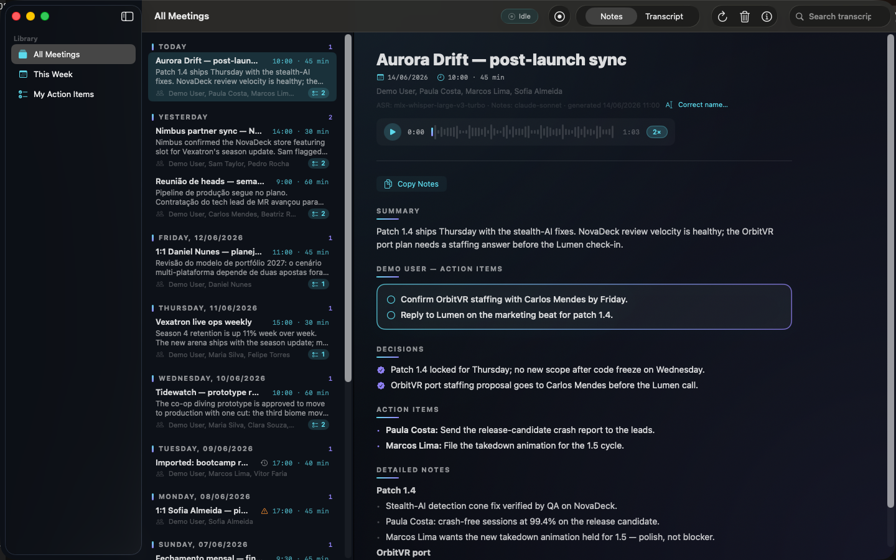

# Blaise

Local-first macOS meeting transcription and notes. Blaise records your system
audio and microphone, transcribes the conversation on-device (Portuguese/English
code-switching is a first-class case, not an afterthought), and writes structured
notes with your action items pulled out and made impossible to miss. Your audio
never leaves the machine.



## Why Blaise

- **On-device transcription.** Speech-to-text runs locally with Whisper
  (`large-v3-turbo`) by default, or FluidAudio's Parakeet engine — switchable in
  Settings. No audio is uploaded to transcribe.
- **Action items are the point.** Every meeting produces a dedicated action-items
  section. This is the load-bearing output: the thing you came for, surfaced
  first and stated plainly, never buried in a wall of summary.
- **Bring your own agentic system.** Notes are written to a content-addressed
  JSON payload with a documented schema, and (optionally) a Markdown sidecar that
  Obsidian and most note systems ingest natively. Deliver into any local, iCloud,
  or synced folder you point Blaise at. The format is built to be consumed by
  external tools and AI agents, not just read in the app.

## Features

- **Two-track, crash-safe capture.** A CoreAudio process tap records meeting audio
  and your microphone as two separate tracks in one drift-compensated device. No
  bot joins your call; nothing is automated in the meeting UI. Compressed audio is
  always retained so a transcript can be regenerated, and a crash mid-recording
  never loses what was already captured.
- **Code-switching, handled.** Portuguese and English mid-sentence is the case
  Blaise is built around. Notes follow the dominant language of the meeting and
  preserve quoted phrases in their original language.
- **Your glossary, filled by your agent.** A self-describing `Glossary.md` teaches
  Blaise the people, companies, products, and project names it will hear — and its
  header is a prompt you can point your own AI agent at to fill it in from your
  context. (See *First-run setup* below.)
- **Structured notes, your action items.** Notes are written for humans;
  transcripts are kept verbatim for machines. The notes carry an explicit
  decisions section and a personal action-items section rendered with your name.
- **Optional Google Meet participant names.** A passive Chrome extension reads the
  Meet participant roster and active-speaker timing from the page and feeds them to
  Blaise for speaker naming. It captures display names and speaking times only — no
  audio, no captions, no chat — and delivers them encrypted to the app on
  localhost. It is entirely optional; Blaise works without it.
- **Optional direct Google Calendar.** If macOS Calendar is not a reliable view of
  your Google calendars, Blaise can connect to Google Calendar directly using a
  read-only OAuth grant. Upcoming meetings feed the menu bar, the top of the
  meeting list, one-click recording, and calendar-aware end detection.
- **Search and library.** Full-text search across every transcript and note, with
  accent-insensitive matching.

## Privacy model

Blaise is local-first by design, and the privacy boundary is stated honestly:

- **Your audio never leaves the machine.** Recording, retention, and transcription
  are all on-device. There is no upload path for audio.
- **One optional cloud call: notes synthesis.** By default, notes are written by
  Claude (Anthropic's Sonnet model) under **your own API key**, which means the
  meeting *transcript* — not the audio — is sent to Anthropic for that one step.
  This is the only network call that carries meeting content, and it is opt-in by
  configuring a key.
- **Spend tracking and a ceiling are built in.** Blaise tracks what the notes step
  costs and enforces a configurable monthly ceiling, so the cloud step can never
  run away.
- **Fully offline mode.** Select the local MLX notes engine and Blaise synthesises
  notes entirely on-device. If neither a cloud key nor a local model is available,
  the meeting is transcribed and stored with notes marked *pending* — nothing is
  lost, and notes can be generated later.

## Install

### From a release

1. Download `Blaise.app` from the [Releases](../../releases) page.
2. Release builds are **unsigned**. macOS Gatekeeper will refuse a plain
   double-click. To open it the first time: **right-click (or Control-click) the
   app → Open**, then confirm in the dialog. After that first launch it opens
   normally.

### From source

Requirements: **macOS 26 or later** and **Xcode 26**. A release build takes a
few minutes.

```sh
scripts/build_app.sh   # release build → dist/Blaise.app, prints the app path
open dist/Blaise.app
```

The build is pure Swift Package Manager — there is no `.xcodeproj`. The scripts
invoke the Xcode toolchain's `swift` directly with an explicit SDK root, so the
Xcode licence does not need to be accepted on a developer machine. The first
build fetches the pinned Swift package dependencies; the first launch provisions
the on-device transcription runtime (a managed Python environment and the model
weights) into the app's own data folder.

### Optional Meet extension

Blaise records fine on its own. To *also* pull Google Meet participant names and
active-speaker timing (for better speaker labelling), install the companion
Chrome extension:

1. Download `blaise-meet-extension.zip` from the [Releases](../../releases) page
   and unzip it (or use the repo's `extension/` folder if you cloned it).
2. Open `chrome://extensions` and toggle **Developer mode** (top right).
3. Click **Load unpacked** and select the unzipped folder (the one containing
   `manifest.json`).

It reads only participant display names and speaking times from the Meet page and
delivers them encrypted to Blaise on `127.0.0.1` — no audio, captions, or chat,
and nothing leaves your machine. Entirely optional.

### Optional Google Calendar

Apple Calendar access remains the zero-network path. For a direct Google Calendar
connection, create a Google OAuth **Desktop app** client ID, paste it in Settings
→ Automation → Calendars, and press Connect. Blaise requests
`https://www.googleapis.com/auth/calendar.readonly`, stores the refresh token in
the macOS Keychain, and reads calendar events only.

## First-run setup

On first launch Blaise walks you through:

1. **Permissions.** macOS prompts for Microphone, System Audio Recording,
   Calendar (for one-click recording suggestions from upcoming events), and
   Notifications. Grant them once. Direct Google Calendar can be connected later
   from Settings and does not replace the local Calendar permission.
2. **Identity.** Your name, the nicknames people call you in meetings, and your
   email (used to match you against calendar attendees). Your name is what the
   action-items section is rendered with.
3. **Glossary — point your agent at it.** This is the novel bit. Blaise keeps a
   `Glossary.md` in its data folder that teaches it the names it will hear:
   people, companies, products, projects. The file is **self-describing** — its
   header is a set of instructions addressed to an AI agent:

   > You are filling in a speech-recognition glossary for your user. Add one line
   > per name under the `## Entries` heading, in the format
   > `Canonical Name | misheard1 | misheard2` …

   Open Settings → Glossary, press **Copy agent prompt**, and hand that prompt to
   Claude, ChatGPT, or your Obsidian agent pointed at the file. The agent fills in
   your contacts, org chart, and project vocabulary from your own context, and
   Blaise uses it to fix misheard words in transcripts and spell names correctly
   in notes. You can also edit entries directly in the Settings table. The shipped
   glossary is empty (instruction header plus commented examples) — it never
   corrects anyone's transcript until you fill it in.

## Architecture

```
            ┌──────────────────────┐         ┌────────────────────┐
  audio ──▶ │  Live capture        │         │  Chrome extension  │
  (system   │  (CoreAudio tap+mic, │         │  (Meet roster +    │
   + mic)   │   two crash-safe     │         │   speaking times,  │
            │   tracks)            │         │   localhost, AEAD) │
            └──────────┬───────────┘         └─────────┬──────────┘
                       │                                │
                       ▼                                ▼
            ┌──────────────────────────────────────────────────────┐
            │  Processing pipeline (BlaiseCore)                     │
            │  ASR → diarization → speaker merge/resolve →         │
            │  vocabulary correction → dominant language →         │
            │  notes synthesis → finalize + enqueue handoff        │
            └──────────┬───────────────────────────────┬───────────┘
                       │                                │
                       ▼                                ▼
            ┌────────────────────┐         ┌────────────────────────┐
            │  Local store       │         │  Handoff queue         │
            │  (SQLite/GRDB,     │         │  (content-addressed    │
            │   FTS5 search,     │         │   JSON payload →       │
            │   per-meeting      │         │   local folder or SSH, │
            │   files)           │         │   queue-and-retry)     │
            └────────────────────┘         └────────────────────────┘
                       │
                       ▼
            ┌────────────────────┐
            │  App UI (SwiftUI): │
            │  library, detail,  │
            │  search, settings  │
            └────────────────────┘
```

Each subsystem has a spec under [`specs/`](specs/) — they document current
behaviour and are the best entry point for contributors:

- [`specs/c1_scaffold_storage.md`](specs/c1_scaffold_storage.md) — storage, schema, file layout
- [`specs/c2_engine_interfaces.md`](specs/c2_engine_interfaces.md) — the swappable ASR/summarization engine seams
- [`specs/c3_asr_engines.md`](specs/c3_asr_engines.md) — Whisper and Parakeet transcription engines
- [`specs/c4_diarization.md`](specs/c4_diarization.md) — speaker diarization
- [`specs/c5_vocab_correction.md`](specs/c5_vocab_correction.md) — glossary-driven vocabulary correction
- [`specs/c6_notes_synthesis.md`](specs/c6_notes_synthesis.md) — notes synthesis (cloud and local engines)
- [`specs/c7_pipeline.md`](specs/c7_pipeline.md) — the end-to-end processing pipeline
- [`specs/c8_handoff_queue.md`](specs/c8_handoff_queue.md) — the queue-and-retry handoff
- [`specs/c10_app_shell.md`](specs/c10_app_shell.md) — the SwiftUI app shell
- [`specs/c11_live_capture.md`](specs/c11_live_capture.md) — two-track live capture
- [`specs/c12_meet_extension.md`](specs/c12_meet_extension.md) — the Google Meet extension
- [`specs/c14_recording_automation.md`](specs/c14_recording_automation.md) — start/stop recording automation
- [`specs/g1_user_glossary.md`](specs/g1_user_glossary.md) — the agent-fillable glossary

## Contributing

Contributions are welcome. See [CONTRIBUTING.md](CONTRIBUTING.md) for how to build,
run the tests, and open a pull request. One thing to know up front, because it is
the project's bar: **tests must pass by their exit code, and they are never
weakened or gamed to go green.** Environment-gated tests (real audio hardware, API
keys, heavyweight models) skip cleanly and record their reason rather than
silently passing.

## Licence

[MIT](LICENSE).

## Third-party content / licensing

Blaise's own code is [MIT](LICENSE). The one exception is the test audio fixture
under `fixtures/icsi_sample/` (and the speech-recognition and diarization JSON
derived from it): that is third-party material from the ICSI Meeting Corpus,
licensed under **Creative Commons Attribution 4.0 (CC BY 4.0)**, not under the
project's MIT licence. See [`fixtures/icsi_sample/ATTRIBUTION.md`](fixtures/icsi_sample/ATTRIBUTION.md)
for the attribution that must be preserved on redistribution.

## Third-party notices

- [FluidAudio](https://github.com/FluidInference/FluidAudio) (Apache-2.0) —
  Parakeet TDT v3 CoreML ASR runtime.
- [GRDB.swift](https://github.com/groue/GRDB.swift) (MIT) — SQLite persistence.
- [Pow](https://github.com/EmergeTools/Pow) (MIT) — UI micro-interactions.
- [uv](https://github.com/astral-sh/uv) (MIT/Apache-2.0) — vendored binary that
  provisions the app-managed Python environment for the Whisper engine
  (mlx-whisper, MIT).
